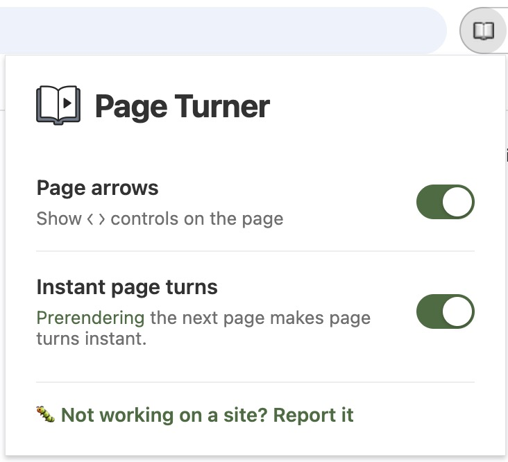

# Page Turner - Chrome extension 
Navigate paginated webpages with your keyboard's arrow keys.  
Perfect for search results, image galleries and more.

Indicates found links via page arrows (can turn these off in settings), and arrows inside the extension icon itself.

I created this from my wish that any website with a back or next link could be controlled from my keyboard's arrow keys.  

## Install
https://chromewebstore.google.com/detail/page-turner/fpbddhncmmhkaofhcnkjgcdbgcmomebo

## Settings
Pin the icon to your bookmarks bar and click it to see the extension options. 

## Preloading pages
The Speculation Rules API loads the Next detected page in the background so that when you click -> on the keyboard, the page loads instantly.   
It is effectively a Chromium-only feature today. It's a Chrome-originated API that's not yet a finished web standard, so support splits cleanly along engine lines — Chromium ships it, WebKit has it built but dormant, Gecko doesn't have it at all.
https://developer.chrome.com/docs/web-platform/prerender-pages - the spec.
 
### Supported browsers
Chrome, Edge, Opera and Vivaldi

### Not supported browsers
Brave, Firefox, Safari

## Permissions
This extension requires the following permissions:

- **Tabs**: To update the extension icon when Previous/Next links are found on the active tab
- **Storage**: To save your settings and remember per-tab link detection state
- **Host Access**: To let the content script scan each page you visit for Previous/Next links

## Privacy
This extension stores everything locally and does not transmit any information anywhere. There are no analytics, no external servers and no data collection.

## Not working?
If a site you want to use with this is not supported, please create an issue and let me know!
https://github.com/n8kowald/page-turner/issues/new

If I can support more Previous / Next link detection cases, that makes this better for everyone.

## Sites I check
With every change, I check these websites to make sure back/next link detection is working.  

- https://www.google.com/search?q=test
- https://search.brave.com/search?q=test
- https://www.amazon.com/s?k=test
- https://www.ebay.com/sch/i.html?_nkw=laptop
- https://www.bing.com/search?q=test
- https://www.ecosia.org/search?q=test
- https://www.startpage.com/sp/search?query=test
- https://html.duckduckgo.com/html/?q=test
- https://forums.macrumors.com/threads/what-to-expect-from-apples-big-week-iphone-17e-low-cost-macbook-new-ipads-and-more.2478339
- https://old.reddit.com/r/all/
- https://github.com/search?q=test&type=issues
- https://au.search.yahoo.com/search?p=test (search input autofocused so need to click outside)

## License
Copyright (C) 2012-2026 Nathan Kowald

This program is free software: you can redistribute it and/or modify it under the terms of the GNU General Public License as published by the Free Software Foundation, either version 3 of the License, or (at your option) any later version.

This program is distributed in the hope that it will be useful, but WITHOUT ANY WARRANTY; without even the implied warranty of MERCHANTABILITY or FITNESS FOR A PARTICULAR PURPOSE. See the [LICENSE](LICENSE) file for details.

