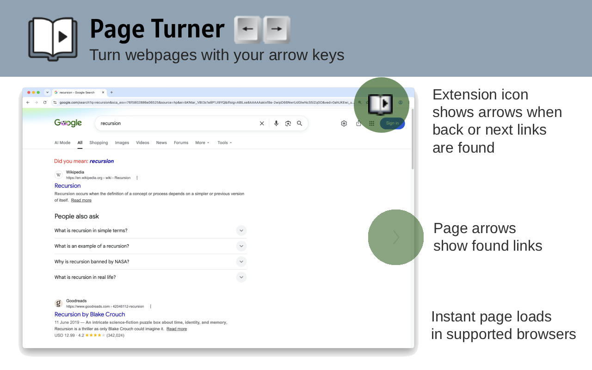

# Page Turner - Chrome extension 
Detects Back and Next links in webpage pagination and allows you to use your keyboard's left/right arrow keys to go back/next.  

The extension indicates found links via page arrows (can turn these off in settings), and arrows inside the extension icon itself.

I created this from my wish that any website with a back or next link could be controlled from my keyboard's arrow keys.  

## Install
https://chrome.google.com/webstore/detail/page-turner/fpbddhncmmhkaofhcnkjgcdbgcmomebo

## Extension options
Pin the icon to your bookmarks bar and click it to see the extension options. 

## Preloading pages
The Speculation Rules API loads the Next detected page in the background so that when you click -> on the keyboard, the page loads instantly.   
It is effectively a Chromium-only feature today. It's a Chrome-originated API that's not yet a finished web standard, so support splits cleanly along engine lines — Chromium ships it, WebKit has it built but dormant, Gecko doesn't have it at all.
https://developer.chrome.com/docs/web-platform/prerender-pages - the spec.
 
### Support
Chrome, Edge, Opera and Vivaldi

### No support
Brave, Firefox, Safari

## Not working?
If a site you want to use with this is not supported, please create an issue and let me know!
https://github.com/n8kowald/page-turner/issues/new

If I can support more Previous / Next link detection cases, that makes this better for everyone.

## Sites I check
With every change, I check these websites to make sure back/next link detection is working.  

- https://www.google.com/search?q=test
- https://search.brave.com/search?q=test
- https://www.amazon.com/s?k=test
- https://www.ebay.com/sch/i.html?_nkw=laptop
- https://www.bing.com/search?q=test
- https://www.ecosia.org/search?q=test
- https://www.startpage.com/sp/search?query=test
- https://html.duckduckgo.com/html/?q=test
- https://forums.macrumors.com/threads/what-to-expect-from-apples-big-week-iphone-17e-low-cost-macbook-new-ipads-and-more.2478339
- https://old.reddit.com/r/all/
- https://github.com/search?q=test&type=issues
- https://au.search.yahoo.com/search?p=test (search input autofocused so need to click outside)

